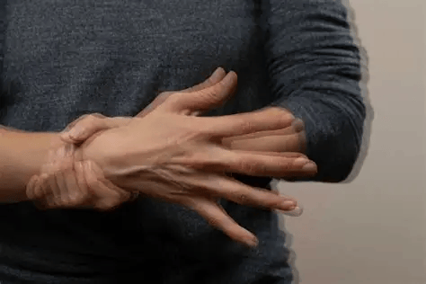
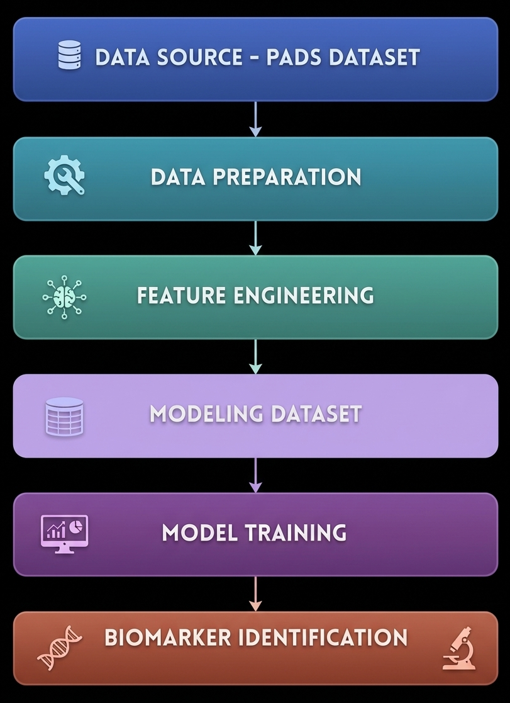

# Behavioral Health Informatics - Parkinson's Disease Detection

<p align="center">
	
</p>

## Table of Contents

- [Introduction](#introduction)
- [System Architecture](#system-architecture)
- [Core Components](#core-components)
- [Data Processing Pipeline](#data-processing-pipeline)
- [ML Components](#ml-components)
- [Dashboard and Visualization](#dashboard-and-visualization)
- [Data Insights](#data-insights)
- [Getting Started](#getting-started)
- [Performance and Results](#performance-and-results)
- [Limitations and Future Work](#limitations-and-future-work)
- [Team and Contributors](#team-and-contributors)
- [Conclusion](#conclusion)
- [References](#references)

## Introduction

Parkinson's disease is a progressive neurodegenerative disorder in which early and reliable screening is still challenging in routine clinical practice. This project develops a machine learning workflow for PD vs non-PD classification using two complementary modalities: smartwatch inertial signals (accelerometer and gyroscope) and self-reported clinical questionnaire features, extracted from the PADS dataset.

Dataset source: [PhysioNet - Parkinson's Disease Smartwatch Dataset v1.0.0](https://physionet.org/content/parkinsons-disease-smartwatch/1.0.0/)

- Research question: To what extent can smartwatch-based sensor features complement or replicate the predictive power of self-reported questionnaire data for early detection of Parkinson's disease, and how can the combination of both improve predictive performance?

## System Architecture

The system follows a modular pipeline architecture organized into six layers:

- **Data Source Layer**: Uses the PADS dataset from PhysioNet as the unified source of smartwatch inertial signals and questionnaire data.
- **Data Preparation Layer**: Cleans and harmonizes sensor and clinical records, aligns patient identifiers, and prepares analysis-ready tables.
- **Feature Engineering Layer**: Builds patient-level descriptors from repeated sessions, including statistical and variability-based motor features.
- **Modeling Dataset Layer**: Creates leakage-aware train/test splits with age-aware stratification, then removes demographic fields before model learning.
- **Model Training Layer**: Trains and tunes setup-specific models (sensors only, questionnaires only, combined) with cross-validation and ROC-AUC optimization.
- **Biomarker Identification Layer**: Applies permutation importance to identify the most informative digital biomarkers for PD vs non-PD discrimination.

### Architecture Flow




## Core Components

- Data ingestion and preprocessing utilities
- Patient-level feature engineering from repeated sessions
- Leakage-aware split and feature selection pipeline
- Random Forest tuning and evaluation framework
- Fair-comparison and interpretability analyses

## Data Processing Pipeline

The pipeline starts from modality-specific loading and preprocessing, then aggregates observations at patient level. In the no-demographics objective, demographic variables are merged only to support age-aware stratification in the train/test split. After the split is finalized, demographics are removed from training and test feature matrices, and are not used for feature selection, model fitting, or final evaluation.

Feature preparation is fit on training data only to avoid leakage.

## ML Components

The main model is Random Forest, tuned with RandomizedSearchCV using 5-fold cross-validation and ROC-AUC as optimization metric. Three setup-specific models are trained:
- Setup A: sensors only
- Setup B: questionnaires only
- Setup C: combined modalities

Additional analyses:
- Top-k fair comparison between A and B under the same feature budget
- Cross-model benchmark (Logistic Regression, SVM-RBF, Random Forest, Gradient Boosting)

## Dashboard and Visualization

The project provides report-oriented visual outputs generated from notebooks:
- multi-metric comparison plots
- ROC curve visualizations
- permutation feature importance plots
- model sensitivity and fair-comparison charts

All generated figures are saved in the report figures directory.

## Data Insights

Main findings show that questionnaire-only and sensor-only setups are close on several metrics, while the combined setup performs best overall. Feature importance in the sensor-only setup indicates that cross-test motor variability is one of the strongest discriminative signals between PD and non-PD groups.

## Performance and Results

Test-set performance with tuned Random Forest:

| Setup | Accuracy | ROC-AUC | F1 |
|---|---:|---:|---:|
| A - Sensors only | 0.70 | 0.70 | 0.77 |
| B - Questionnaire only | 0.73 | 0.82 | 0.76 |
| C - All modalities | 0.82 | 0.89 | 0.83 |

Interpretation:
- A and B are comparable overall.
- B has stronger threshold-independent discrimination (ROC-AUC).
- A is slightly stronger at the selected decision threshold (F1).
- C consistently outperforms both unimodal setups, confirming complementarity.

## Limitations and Future Work

- External validation across additional cohorts and devices is still needed.
- Calibration and threshold optimization for deployment should be expanded.
- Larger and more diverse populations are required for stronger generalization.
- Longitudinal modeling could improve progression-aware predictions.

## Conclusion

This study shows that smartwatch-derived sensor features provide predictive performance broadly comparable to questionnaire-based features for PD detection. While questionnaire data achieved higher ROC-AUC and sensor data achieved a slightly better F1-score, the strongest result is that combining both modalities produced the best performance across metrics. This confirms that questionnaires and wearables capture complementary information: symptom-specific self-report on one side, and continuous motor behavior on the other.

Feature-importance analysis further supports this interpretation, highlighting cross-test movement variability as a key discriminative signal in the sensor-only setup. Overall, the project indicates that smart wearables are not only supportive tools, but promising predictive instruments for early screening and prevention-oriented monitoring, especially when integrated with short targeted questionnaires.

## Getting Started

### Prerequisites

- Python 3.10+
- Windows, macOS, or Linux

### Install Dependencies

```bash
pip install -r requirements.txt
```

### Suggested Execution Order

1. notebooks/01_data_exploration
2. notebooks/02_feature_engineering/02b_feature_engineering_no_demo.ipynb
3. notebooks/03_model_training/03b_model_training_no_demo_objective.ipynb

### Project Structure

```text
Behavioral-Health-Informatic-Project/
|- data/
|- docs/
|- notebooks/
|  |- 01_data_exploration/
|  |- 02_feature_engineering/
|  |- 03_model_training/
|- report/
|  |- figures/
|  |- PDF report/
|- requirements.txt
|- README.md
```

## Team and Contributors

- [Paolo Fabbri](https://github.com/PaoloFabbri8)

## References

- Dataset: [PhysioNet - Parkinson's Disease Smartwatch Dataset v1.0.0](https://physionet.org/content/parkinsons-disease-smartwatch/1.0.0/)
- El Maachi, M. et al. (2021). [Deep 1D-ConvNet for accurate Parkinson disease detection and severity prediction from gait](https://www.sciencedirect.com/science/article/pii/S0957417419307924). Computers in Biology and Medicine.
- Johnson, S., Kantartjis, M., Severson, J., Dorsey, R., Adams, J. L., Kangarloo, T., Kostrzebski, M. A., Best, A., Merickel, M., Amato, D., Severson, B., Jezewski, S., Polyak, S., Keil, A., Cosman, J., and Anderson, D. (2024). [Wearable sensor-based assessments for remotely screening early-stage Parkinson's disease](https://www.mdpi.com/1424-8220/24/17/5637).
- Mittal, R. et al. (2021). [Machine learning approach to gait analysis for Parkinson's disease detection and severity classification](https://www.frontiersin.org/journals/robotics-and-ai/articles/10.3389/frobt.2025.1623529/full).
- Shawen, N. et al. (2021). [Role of data measurement characteristics in the accurate detection of Parkinson's disease symptoms using wearable sensors](https://link.springer.com/article/10.1186/s12984-020-00684-4).