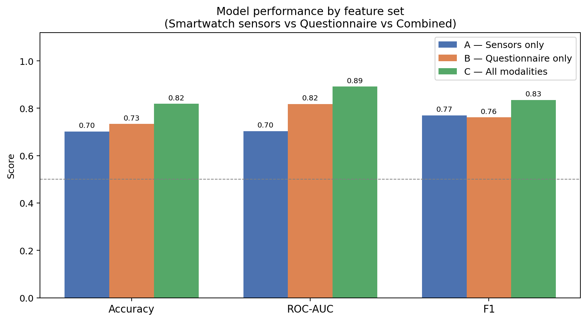
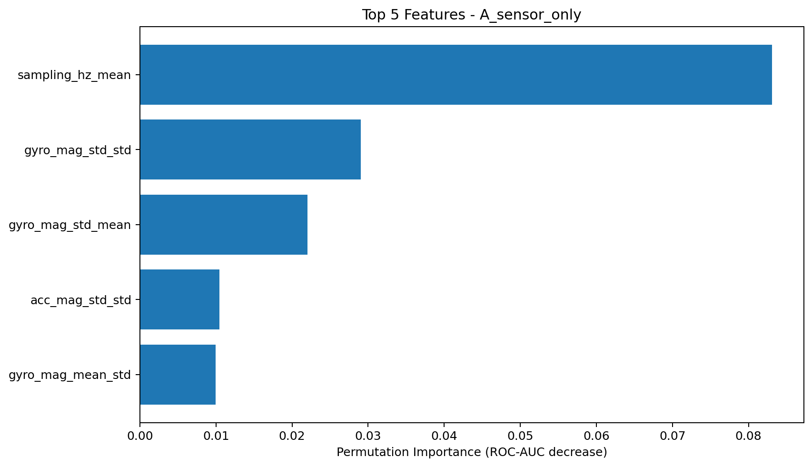

# Behavioral Health Informatics - Parkinson's Disease Detection

<p align="center">
	
</p>

## Table of Contents

- [Introduction](#introduction)
- [System Architecture](#system-architecture)
- [Data Preparation](#data-preparation)
- [Feature Engineering](#feature-engineering)
- [ML Model](#ml-model)
- [Feature Importance](#feature-importance)
- [Conclusion](#conclusion)
- [Limitations and Future Work](#limitations-and-future-work)
- [Getting Started](#getting-started)
- [Team and Contributors](#team-and-contributors)
- [References](#references)

## Introduction

Parkinson's disease is a progressive neurodegenerative disorder in which early and reliable screening is still challenging in routine clinical practice. This project develops a machine learning workflow for PD vs non-PD classification using two complementary modalities: smartwatch inertial signals (accelerometer and gyroscope) and self-reported clinical questionnaire features, extracted from the PADS dataset.

Dataset source: [PhysioNet - Parkinson's Disease Smartwatch Dataset v1.0.0](https://physionet.org/content/parkinsons-disease-smartwatch/1.0.0/)

- Research question: To what extent can smartwatch-based sensor features complement or replicate the predictive power of self-reported questionnaire data for early detection of Parkinson's disease, and how can the combination of both improve predictive performance?

## System Architecture

The system follows a modular pipeline architecture organized into six layers:

- **Data Source Layer**: Uses the PADS dataset from PhysioNet as the unified source of smartwatch inertial signals and questionnaire data.
- **Data Preparation Layer**: Cleans and harmonizes sensor and clinical records, aligns patient identifiers, and prepares analysis-ready tables.
- **Feature Engineering Layer**: Builds patient-level descriptors from repeated sessions, including statistical and variability-based motor features.
- **Modeling Dataset Layer**: Creates leakage-aware train/test splits with age-aware stratification, then removes demographic fields before model learning.
- **Model Training Layer**: Trains and tunes setup-specific models (sensors only, questionnaires only, combined) with cross-validation and ROC-AUC optimization.
- **Biomarker Identification Layer**: Applies permutation importance to identify the most informative digital biomarkers for PD vs non-PD discrimination.

### Architecture Flow


## Data Preparation

The first stage integrates three sources: smartwatch test recordings, questionnaire responses, and patient demographics. During exploratory checks, data quality was generally high. We also analyzed cohort composition and confirmed class imbalance, with PD as the majority class, which motivated a careful evaluation strategy.

Before modeling, we examined demographic and clinical distributions (age, gender, weight, condition prevalence) and tested group differences. This step provided context for the learning problem and helped justify age-aware splitting. In the no-demographics objective, demographics are merged only to enable age-aware stratification and are then removed before feature selection and model training.

At this stage, the target was defined as a binary label (PD vs non-PD), with patient-level consistency preserved across all merged tables.

## Feature Engineering

Feature engineering was designed as a multi-stage, leakage-safe pipeline.

To answer the research question, three setups were created: sensor-only (A), questionnaire-only (B), and combined (C). A training-only feature selection workflow was then applied: missingness filtering, median imputation, high-correlation removal, and ranking with a composite ANOVA F-test plus Mutual Information score. The top features were retained per setup, and all fitted transformations were transferred to test data without re-estimation.

## ML Model

Random Forest was used as the primary classifier because it performs well on structured biomedical data, captures non-linear interactions, and remains interpretable through feature-importance analysis. Model development was executed separately for each setup (A, B, C).

For each setup, hyperparameters were tuned on training data only with RandomizedSearchCV (5-fold cross-validation, ROC-AUC scoring). The best configuration was then used to train the final model on the full training split, and evaluation was performed on the held-out test split using Accuracy, F1-score, ROC-AUC, precision, recall, and balanced accuracy.



## Feature Importance

After training, permutation importance was computed on the test set to identify the most discriminative features for each setup. This approach measures the drop in model performance when each feature is randomly shuffled, providing a model-agnostic view of variable relevance that is not biased by split structure.



## Conclusion

This study shows that smartwatch-derived sensor features provide predictive performance broadly comparable to questionnaire-based features for PD detection. While questionnaire data achieved higher ROC-AUC and sensor data achieved a slightly better F1-score, the strongest result is that combining both modalities produced the best performance across metrics. This confirms that questionnaires and wearables capture complementary information: symptom-specific self-report on one side, and continuous motor behavior on the other.

Feature-importance analysis further supports this interpretation, highlighting cross-test movement variability as a key discriminative signal in the sensor-only setup. Overall, the project indicates that smart wearables are not only supportive tools, but promising predictive instruments for early screening and prevention-oriented monitoring, especially when integrated with short targeted questionnaires.

## Limitations and Future Work

### Current Limitations

- **Gender imbalance**: The PADS dataset contains a significantly higher proportion of male PD patients than female, which may cause the model to learn patterns more representative of male motor behavior. This limits generalizability to female populations, which are already underrepresented in Parkinson's research.
- **Cross-sectional design**: All observations are collected at a single point in time. Without repeated measurements over months or years, the pipeline cannot model disease progression or early-stage trajectories — it can only discriminate already-diagnosed PD from non-PD at the moment of recording.
- **Single-dataset dependency**: The entire pipeline was developed and evaluated on one publicly available dataset. Differences in device models, recording protocols, or clinical conventions across institutions may reduce transferability to real-world settings.
- **Calibration and threshold optimization**: The decision threshold was not optimized for any specific clinical cost function (e.g., minimizing false negatives in screening), which limits deployment readiness.

### Future Directions

- **Deep learning architectures**: Replacing hand-crafted features with end-to-end models such as 1D-CNNs or Transformer-based architectures directly on raw inertial signals could capture richer temporal patterns and reduce dependence on manual feature engineering.
- **Panel data and longitudinal modeling**: Collecting repeated measurements from the same individuals over time would enable the study of trajectory-based features — potentially revealing which behavioral and motor variables are predictive of future PD onset, shifting the goal from detection to prevention-oriented early warning.
- **External validation**: Testing the pipeline on independent cohorts recorded with different devices and clinical protocols is essential to confirm generalizability before any clinical translation.

## Getting Started

### Prerequisites

- Python 3.10+
- Windows, macOS, or Linux

### Install Dependencies

```bash
pip install -r requirements.txt
```

### Suggested Execution Order

1. notebooks/01_data_exploration
2. notebooks/02_feature_engineering/02b_feature_engineering_no_demo.ipynb
3. notebooks/03_model_training/03b_model_training_no_demo_objective.ipynb

### Project Structure

```text
Behavioral-Health-Informatic-Project/
|- data/
|- docs/
|- notebooks/
|  |- 01_data_exploration/
|  |- 02_feature_engineering/
|  |- 03_model_training/
|- report/
|  |- figures/
|  |- PDF report/
|- requirements.txt
|- README.md
```

## Team and Contributors

- [Paolo Fabbri](https://github.com/PaoloFabbri8)

## References

- Dataset: [PhysioNet - Parkinson's Disease Smartwatch Dataset v1.0.0](https://physionet.org/content/parkinsons-disease-smartwatch/1.0.0/)
- El Maachi, M. et al. (2021). [Deep 1D-ConvNet for accurate Parkinson disease detection and severity prediction from gait](https://www.sciencedirect.com/science/article/pii/S0957417419307924). Computers in Biology and Medicine.
- Johnson, S., Kantartjis, M., Severson, J., Dorsey, R., Adams, J. L., Kangarloo, T., Kostrzebski, M. A., Best, A., Merickel, M., Amato, D., Severson, B., Jezewski, S., Polyak, S., Keil, A., Cosman, J., and Anderson, D. (2024). [Wearable sensor-based assessments for remotely screening early-stage Parkinson's disease](https://www.mdpi.com/1424-8220/24/17/5637).
- Mittal, R. et al. (2021). [Machine learning approach to gait analysis for Parkinson's disease detection and severity classification](https://www.frontiersin.org/journals/robotics-and-ai/articles/10.3389/frobt.2025.1623529/full).
- Shawen, N. et al. (2021). [Role of data measurement characteristics in the accurate detection of Parkinson's disease symptoms using wearable sensors](https://link.springer.com/article/10.1186/s12984-020-00684-4).